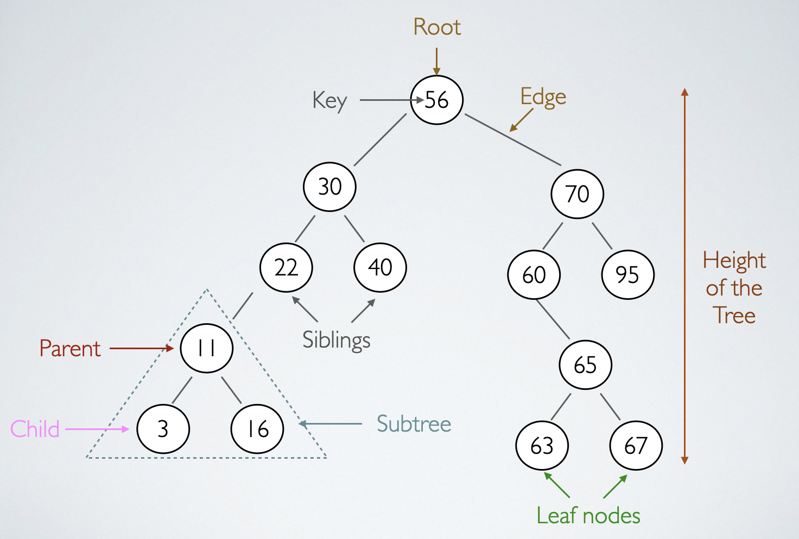
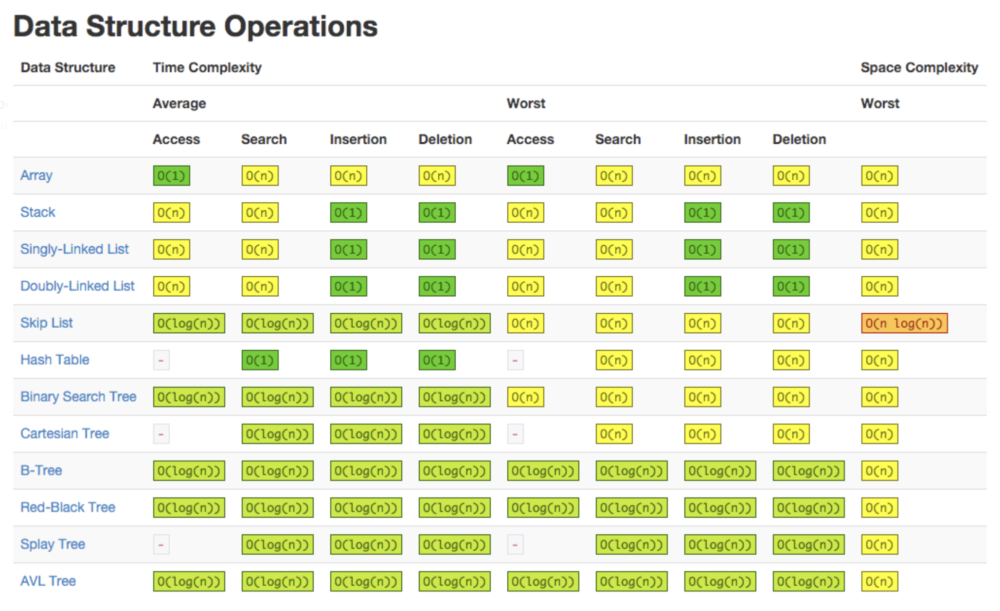

##Original from [HERE](https://levelup.gitconnected.com/an-into-to-binary-search-trees-432f94d180da)


### Into Binary Search Tree

</img>

Binary search trees are excellent ways to store sorted data. The data structure can provide a relatively quick run time of 
O (log(n)) for searching, insertion and removal. This post will walk through what a Binary Search Tree(BST) is, how to create 
one, and how to implement insertion and lookup methods.

바이너리 서치 트리(이진 탐색 트리) 는 데이터를 정렬하여 저장하기에 아주 적합한 방식이다. 이러한 데이터 구조는 상대적으로 빠른 탐색, 삽입, 삭제 시간(O(log(N)))을 제공해준다.
이 포스트는 바이너리 서치 트리를 구현해보고, 삽입과 보기 메소드가 어떻게 이루어져 있는지 살펴보자 !


#### Definition

As seen in the image at the top, a BST is a collection of nodes that have a value (key) and up to two pointers, left and right.
The pointers, when populated, point to child nodes.In a BST, the values of the left children must be lower than thier parent's
values of the right children must be higher.

위에 보이는 그림에서, BST는 노드들의 집합이고, 왼쪽, 오른쪽으로 나타태는 두개의 값을 가지고 있다. 이 포인터는 두 자녀 노드를 지칭한다.
BST에서 왼쪽 노드는 항상 부모 의 값보다 작아야되고, 오른쪽 노드의 값은 항상 부모의 값보다 크다.

> Term's to Know
> 1. Leaf - A node that has no children. In the example above, nodes with values 3, 16, 40, 63, 67 and 95 are all leafs.
> 2. Siblings - Nodes that share the same parent. In the example above, nodes with values with values 30 & 70 are sibilings as 
> well as  22 & 40, 3 & 16, 60 & 95 and 63 & 67.
> 3. Root - The node that sits at the top of the tree.
> 4. Balanced Tress - Trees whose nodes have the same number of children or subtrees.


> 1. Leaf - 자식 노드가 존재하진 않는 노드를 뜻한다. 위의 그림에서는 3, 16, 40, 63, 67, 그리고 95가 모두 리프 노드이다.
> 2. Siblings - 같은 부모를 공유하고 있는 노드들을 의미한다. 위의 그림에서는 0 & 70, 22 & 40, 3 & 16, 60 & 95 그리 63 & 67.고
> 3. Root - 제일 상단에 존재하는 노드를 의미한다.
> 4. Balanced Trees - 트리 중 같은 수의 자녀 노드나 서브 트리를 가진 트리를 의미한다. 

#### How to create a BST with Python

BST are typically created with a BST class and a node class.

BST는 일반적으로 BST class와 Node Class를 만든다.

```python
class Node:
    def __init__(self,val):
        self.val = val
        self.left = None
        self.right = None

class BinarySearchTree:
    def __init__(self):
        self.size= 0
        self.root = None

bst1 = BinarySearchTree() // BinarySearchTree {size:0, root: None}
node1 = Node(1) // Node {val: 1, left :None, right: None
```
##### Insertion
An insertion populates the BST with nodes. The method will accept a value and create a new node. Once the node is created,
the method runs through a series of checks to ensure the node is placed where it satisfies the criteria of lower values sitting to the
left and higher values on the right. If the value already exists, the method returns None.

삽입을 통해 BST노드들을 채운다. 이 메소드는 값을 받고 새로운노드를 만든다. 새로운 노드를 만들고, 매소드는 일련의 확인 과정을 진행함으로써 노드의 위치를 정하게 된다. 값이 작으면 왼쪽에
값이 더크다면 오른쪽에 자리잡게 된다. 만약 밸류가 이미 존재한다면 None을 반환한다.


##### Lookup
A lookup process runs through similar checks to find the node in the tree. If the node does not exist, the method returns None.
보기 프로세스는 트리에서 노드를 찾는 것과 유사하다. 만약 노드가 존재하지 않는다면 None값을 반환한다.

```
class Node:
    def __init__(self,val):
        self.val = val
        self.left = None
        self.right = None
    def __str__(self):
        return self.left, self.right
        

class BinarySearchTree:
    def __init__(self):
        self.size= 0
        self.root = None

    def insert(self,val):
        newNode = Node(val)
        if not (self.root) :
            self.root = newNode
            self.size += 1
            return self

        current = self.root

        while True:
            if val == current.val:
                return None
            if val < current.val :
                if not (current.left):
                    current.left = newNode
                    self.size +=1
                    return self
                else:
                    current = current.left

            elif val > current.val:
                if not (current.right):
                    current.right = newNode
                    self.size+=1
                    return self
                else:
                    current = current.right
                    
    def lookup(self, val):
        if not (self.root):
            return None
        current = self.root

        while True:
            if val == current.val:
                return current.val, current.left, current.right
            if val > current.val:
                if not (current.right):
                    return None
                current = current.right
            elif val < current.val:
                if not (current.left):
                    return None
                current = current.left
                

                


bst1 = BinarySearchTree()

bst1.insert(10)
bst1.insert(6)
bst1.insert(3)
bst1.insert(8)
bst1.insert(15)
bst1.insert(20)

bst1.lookup(10)
bst1.lookup(3)
```

##### Why ? 
</img>


BST's primary benefit is search time!
